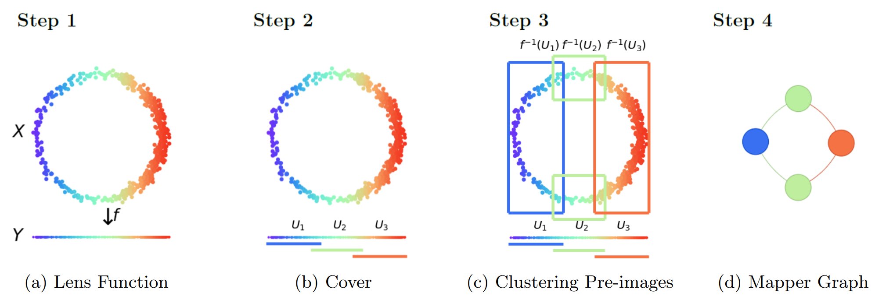
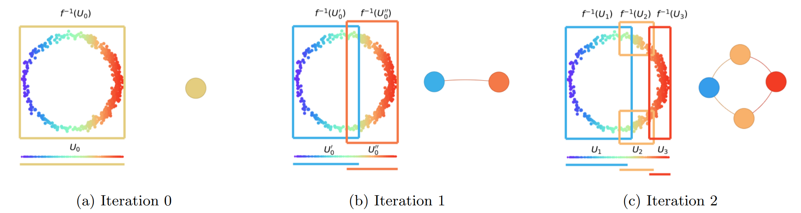

# G-Mapper: Learning a Cover in the Mapper Construction

This project implements an algorithm that we develop in our work on $G$-Mapper: Learning a Cover in the Mapper Construction.

## Abstract
The Mapper algorithm is a visualization technique in topological data analysis (TDA) that outputs a graph reflecting the structure of a given dataset. However, the Mapper algorithm requires tuning several parameters in order to generate a ``nice" Mapper graph. This paper focuses on selecting the cover parameter. We present an algorithm that optimizes the cover of a Mapper graph by splitting a cover repeatedly according to a statistical test for normality. Our algorithm is based on G-means clustering which searches for the optimal number of clusters in $k$-means by iteratively applying the Anderson-Darling test. Our splitting procedure employs a Gaussian mixture model to carefully choose the cover according to the distribution of the given data. Experiments for synthetic and real-world datasets demonstrate that our algorithm generates covers so that the Mapper graphs retain the essence of the datasets, while also running significantly faster than a previous iterative method.  


## Mapper Construction
In 2007, G. Singh, F. Mémoli, and G. E. Carlsson introduced a network-based visualization technique called [***Mapper***](http://dx.doi.org/10.2312/SPBG/SPBG07/091-100). The algorithm takes as input a point cloud dataset and produces as output a graph reflecting the structure of the underlying data. To apply the Mapper algorithm, the user needs to determine the following parameters that include choosing a ***lens*** (or ***filter***) function $f:X \to Y$ from a high-dimensional point cloud $X$ to a lower-dimensional space $Y$, an ***(open) cover*** of the target space $Y$, and a ***clustering*** algorithm for cover elements. Constructing a Mapper graph consists of the following procedure.

1. Lens Function
2. Cover
3. Clustering Pre-images
4. Mapper Graph

<br/>
<div align="center">

</div>
<br/>

To implement the Mapper construction algorithm, we employ the code from [***Mapper Interactive***](https://mapperinteractive.github.io/papers/MapperInteractive-final_submission.pdf) developed by Y. Zhou, N. Chalapathi, A. Rathore, Y. Zhao, and B. Wang in 2021 (https://github.com/MapperInteractive/MapperInteractive).


Optimizing these parameters is essential for generating a "nice" Mapper graph. We concentrate on tuning a ***cover*** given by a collection of overlapping intervals. While the traditional Mapper algorithm takes a uniform cover with the number of intervals and the same overlapping percent between consecutive intervals to be specified by the user, sophisticated methods have recently been applied to optimize the cover of Mapper.

## G-Mapper
We propose a new Mapper construction algorithm called $G$***-Mapper*** for optimizing a cover of the Mapper graph based on G[***-means***](https://proceedings.neurips.cc/paper_files/paper/2003/file/234833147b97bb6aed53a8f4f1c7a7d8-Paper.pdf) clustering. The G-means clustering algorithm aims to learn the number $k$ of clusters in the $k$-means clustering algorithm according to a statistical test, called the ***Anderson–Darling*** test, for the hypothesis that the points in a cluster follow a ***Gaussian*** distribution. Our algorithm splits a cover element iteratively, with our splitting decision determined by the Anderson–Darling score. For further elaboration, we split each cover element into two overlapping intervals by employing a ***Gaussian mixture model*** (GMM) so that the splits are made according to the characteristics of the cover element rather than yielding uniform intervals. This procedure allows us to take variance into account when forming cover elements, making our algorithm perform well without the initialization of a cover.

<br/>
<div align="center">

</div>
<br/>

Parameters for $G$-Mapper are listed:
- AD\_threshold: the critical value corresponding to the significance level $\alpha$ for the statistical test.
- g\_overlap: the amount of overlap when an interval is split in two.
- (Search) method: 'BFS', 'DFS', and 'randomized'.

Our $G$-Mapper is inspired by an algorithm called [***Multipass AIC/BIC***](https://ieeexplore.ieee.org/stamp/stamp.jsp?tp=&arnumber=9671324). In 2021, motivated by the [***X-means***](https://web.cs.dal.ca/~shepherd/courses/csci6403/clustering/xmeans.pdf) algorithm for estimating the number of clusters in $k$***-means*** according to the ***Bayesian Information Criterion*** (BIC), N. Chalapathi, Y. Zhou, and B. Wang devised the algorithm which repeatedly splits intervals of a coarse cover according to information criteria (https://github.com/tdavislab/mapper-xmean-cover).


## Reference
* E. Alvarado, R. Belton, E. Fischer, K. J. Lee, S. Palande, S. Percival, and E. Purvine. G-Mapper: Learning a Cover in the Mapper Construction. arXiv preprint arXiv:2309.06634 (2023).


```
@article{alvarado2023g,
  title={G-Mapper: Learning a Cover in the Mapper Construction},
  author={Alvarado, Enrique and Belton, Robin and Fischer, Emily and Lee, Kang-Ju and Palande, Sourabh and Percival, Sarah and Purvine, Emilie},
  journal={arXiv preprint arXiv:2309.06634},
  year={2023}
}
```
